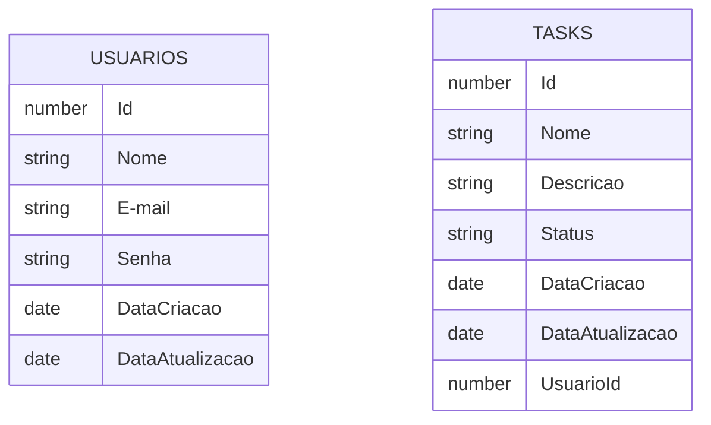

O Task Manager é mais um sistemas simples voltada inteiramente aos meus estudos em Java, Spring Boot, React.js e outras ferramentas necessarias na programação atualmente;

Primeiro fase 0: 
    - Criação do projeto através do "Spring Initializr" com as dependencias necessarias;
    - Configuração inicial e temporaria de containers Docker para o banco de dados em Postgres;
    - De começo duas tabelas principais:
      

