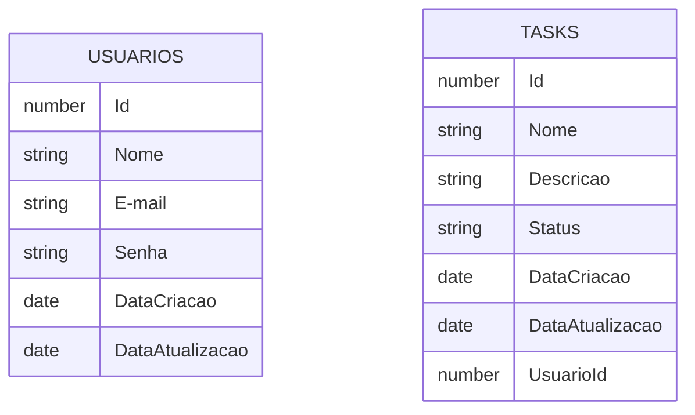

O Task Manager é mais um sistemas simples voltada inteiramente aos meus estudos em Java, Spring Boot, React.js e outras ferramentas necessarias na programação atualmente;

Fase 0: 
    - Criação do projeto através do "Spring Initializr" com as dependencias necessarias;
    - Configuração inicial e temporaria de containers Docker para o banco de dados em Postgres;
    - De começo duas tabelas principais:
      

Fase 1:
    -Criação das Models, Controlleres, Repository;
    -Inserido o padrão de do Basic Auth com Spring security(Posteriormente vou fazer modificações afim de emlhorar a autenticação);
    

Primeiros Testes com Banco de Dados junto com Postman

