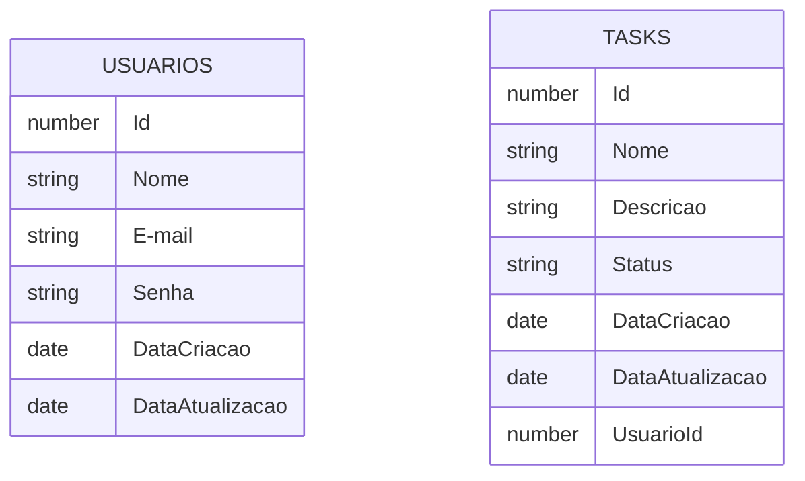
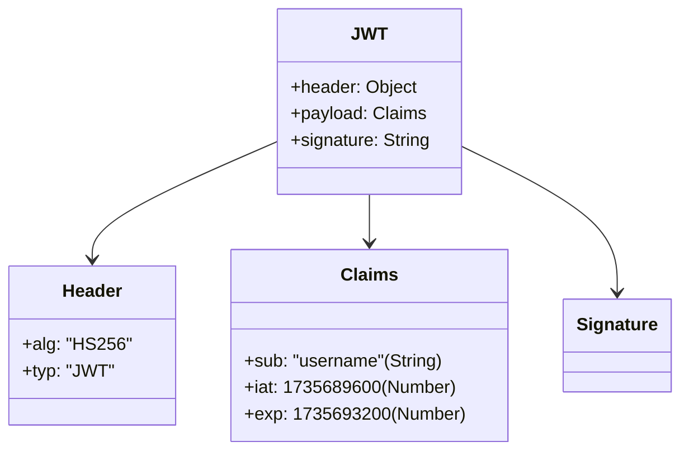
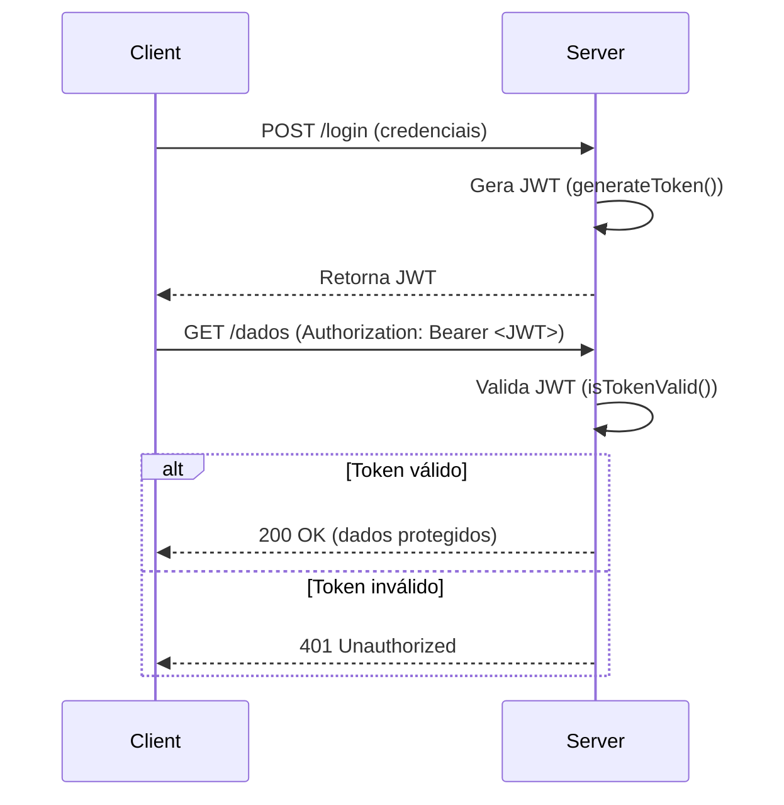

O Task Manager é mais um sistemas simples voltada inteiramente aos meus estudos em Java, Spring Boot, React.js e outras ferramentas necessarias na programação atualmente;

Fase 0: 

    - Criação do projeto através do "Spring Initializr" com as dependencias necessarias;
    - Configuração inicial e temporaria de containers Docker para o banco de dados em Postgres;
    - De começo duas tabelas principais:
      

Fase 1:

    -Criação das Models, Controlleres, Repository;

    -Inserido o padrão de do Basic Auth com Spring security(Posteriormente vou fazer modificações afim de melhorar a autenticação);
    

Primeiros Testes com Banco de Dados junto com Postman

Usuários:

Tarefas:

***Ocorreram várias modificações no decorrer dessa fase, afim de simplificar a possibilidade do cadastro de ambas as tabelas.

Fase 2:

    -Integração do JWT Token:
    

    -JWT Token é muito utilizado em verificações HTTP. Utilizado amplamente por sua segurança, que é feita por uma assinatura digital. É portável, ou seja, pode carregar informaçoes extras(ex: roles do usuário, e-mail, Id, nome e etc).

    Exemplo de fluxo com JWT:

    Começo dos teste.

    Decidi começar com os testes do meu codigo. Foi uma parte bem complicada, mas existem algumas diferenças entre os testes:

        -Teste unitário: O teste unitário, verifica uma parte isolada do codigo, testando somente uma classe ou um metodo especifico, por exemplo o teste que fiz com a validação do Token JWT;

        -Teste de integração: O teste de integração, utiliza todo o contexto de um aplicação, passando por todas as etapas, banco de dados, validação da aplicação, ou seja testes reais;

        -Existe tambem um caso intermediário especifico, conhecido como "slice test", teste de controller com MockMvc + @MockBean, ou seja, um teste de componente com Spring. Foi o caso que utilizei no meu codigo por enquanto para o teste do AuthController.
